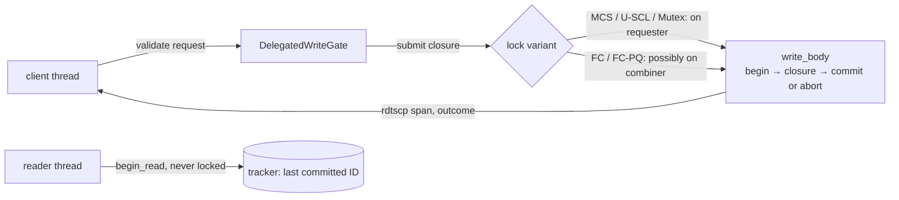

# Service-Fair Delegation in Real Databases: Evidence from redb and UpScaleDB

Date: 2026-09-29. Status: evidence report; it contains no new measurements.
Every number comes from a source listed in [Sources](#sources) and is tagged
with that source, e.g. `[R3]`. `[INFERENCE]` marks claims that were not
measured.

## Abstract

Fairness in a lock usually means *acquisition* fairness: each waiter gets a
turn. When critical sections differ in length, equal turns are not equal
service. FC-PQ is flat combining in which the combiner serves pending requests
in order of each client's accumulated critical-section time. Its purpose is to
decide *who gets served* separately from *how fast the lock runs*. We test this
inside redb's single-writer admission. With the machine pinned to a fixed
3.0 GHz clock, FC-PQ's service-time Jain index in a 1-record vs 64-record writer
mix is 0.941/0.995/0.946 at 2/4/8 clients. FC gets 0.83-0.85 and MCS
0.85-0.86 `[R3]`. FC-PQ's transaction throughput is 1.17-1.34× MCS's, and
MCS incurs 7-11× more HITM loads per transaction (93-126 vs 10-18) `[R3, R5]`.
U-SCL is perfectly service-fair (1.000). At a fixed clock, FC-PQ's throughput
equals U-SCL's (FC-PQ/U-SCL 1.00/1.05 in `all1` tx/s). Under the stock
governor FC-PQ appeared 2.1-3.5× faster, but that lead was a DVFS artifact:
U-SCL's sleeping waiters ran below 1.1 GHz `[R2, R3]`. redb has almost no
non-critical section, so U-SCL's non-work-conservation, its structural
weakness, never shows there. We state this as an untested prediction.
UpScaleDB covers the reader/writer case, but its surviving evidence predates
fixed-clock control and the FC-PQ fast path. It supports "FC-PQ is fairer than
FC". It does not support "FC-PQ matches or beats U-SCL".

## 1 Introduction

A lock schedules critical-section time. Whoever holds it spends a shared,
serial resource, and the lock's policy decides how that resource is divided.
The classic answer is *acquisition fairness*. Ticket locks, MCS and CLH queue
waiters in FIFO order and give each one a turn. A turn, however, is not a unit
of service. In redb, one writer commits a single record while another commits
64 in the same transaction. In UpScaleDB, a find and an insert both run under
one environment mutex, and the insert costs 1.4-2.1× as much `[U3]`. FIFO
gives both clients the same number of turns and therefore most of the lock
*time* to the long requesters. In our redb measurements, the 64-record half
of the clients receives 0.70-0.71 of the write path's time under MCS `[R3]`.
Nothing is starved. The allocation follows request size, not any policy.

Usage-fair locks address this directly. U-SCL (Patel et al., EuroSys'20)
measures how long each thread holds the lock. It grants slices, and a thread
that overuses the lock is banned for a penalty period. The share comes out
right, and in redb U-SCL's service Jain is 1.000 at every client count
`[R3]`. The mechanism has three costs.

- **It is not work-conserving.** A slice owner keeps the lock while it runs
  its non-critical section. Other waiters, even with requests pending, cannot
  enter. The UpScaleDB mechanism test shows the effect: a waiter arriving just
  after the owner's release waits ≈2.18 ms, the remaining slice, while FC-PQ
  admits it in ≈0.6 µs `[U3]`.
- **Its waiters sleep.** That brings wake-up latency and, as we found, lets the
  frequency governor drop the waiters' cores to about 1 GHz. Under the stock
  governor this made FC-PQ look 2.1-3.5× faster than U-SCL in redb. At a fixed
  clock the gap disappears `[R2, R3]`.
- **Its slice length must be tuned.**

Delegation takes a different route. In flat combining (Hendler et al.,
SPAA'10), CC-Synch (Fatourou and Kallimanis, PPoPP'12), RCL (Lozi et al.,
ATC'12) and ffwd (Roghanchi et al., SOSP'17), threads *publish* critical
sections and one combiner executes them. The protected data stays in the
combiner's cache, and the combiner runs whatever is pending, so the lock never
idles while there is work: delegation is work-conserving. It still serves
requests in arrival or scan order, though, so it inherits acquisition fairness.
In redb, FC gives the 64-record half 0.71-0.72 of service, no better than MCS
`[R3]`.

That leaves a gap. No existing lock both conserves work and locality *and*
divides service fairly. Caller-executed fair locks move the data on every
hand-off. Usage-fair locks idle with backlog. Delegation locks are fast but
count turns.

Our observation is that the combiner already *is* a scheduler, and it sits on
the lock. It runs every critical section, so it can time each one for free,
charge the time to the requester, and choose the next request by any ordering
it likes. Fairness then needs no extra coordination; it is an ordering policy.
FC-PQ orders pending requests by their clients' accumulated service time. This
is the virtual-time idea of fair queueing applied to a lock's run queue.
Reordering changes who is served next but not where the data lives, so the
fairness should not cost locality.

This report checks that claim in two real databases. The redb evidence is the
stronger. At a fixed 3.0 GHz, FC-PQ is service-fair where FC and MCS are not,
and its transaction throughput is 1.17-1.34× MCS's `[R3]`. Against U-SCL it is
equally fast, not faster. U-SCL's structural weakness, holding the lock
through the non-critical section, cannot show in redb, whose writers have
almost no non-critical section. The UpScaleDB reader/writer results show FC-PQ
fixing FC's unfairness, but they were measured before clock control and before
the FC-PQ fast path. Rerunning them under the redb methodology is the pending
test.

Contributions:

1. **A real-database integration** in which the delegation lock *is* redb's
   single-writer admission. Readers stay outside the lock, and the correctness
   gate passes (64/64 cases, 165 upstream tests) `[R1]`.
2. **Evidence that FC-PQ separates service allocation from lock speed.**
   Service Jain is 0.94-1.00 against 0.83-0.86 for FC and MCS. Throughput
   equals FC's in the homogeneous `all1` mix, and FC-PQ has 7-11× fewer HITM
   loads than MCS `[R3, R5]`.
3. **Methodology.** Fairness is service-time Jain, charged to the *requester*
   even when a combiner executes the request. Clock control (S1) turned a
   2-3.5× "win" over U-SCL into parity; this should be standard for any
   comparison with a lock whose waiters sleep `[R2]`.
4. **A falsifiable prediction** for where FC-PQ should beat U-SCL on
   throughput: workloads with a non-critical section. The prediction is
   FC-PQ/U-SCL ≈ min(N, (c+n)/c) `[INFERENCE]`.

## 2 Background and locks compared

| Lock | Who executes the CS | Ordering | Waiting | Fairness it targets |
|---|---|---|---|---|
| native (redb upstream) | requester | redb `Mutex<State>` + Condvar; whoever wakes first | block (futex) | none |
| MCS | requester | FIFO queue | spin | acquisition (turns) |
| U-SCL | requester | slice owner; over-users banned | futex hand-off, `nanosleep` while banned, `sched_yield` after 20 spins | usage (held time), 2 × 2400 × 1000 TSC cycles ≈ 2.2 ms slice |
| FC | combiner | publication-list scan | spin | none beyond scan order |
| FC-PQ | combiner | min accumulated service time (priority queue) | spin | service time, charged to requester |

Source: `[R1]` (redb README "Variants" and the U-SCL paragraph).

**FC-PQ fast path.** In the E0(b) microbenchmark, stock FC-PQ paid +64.7 ns
per request over FC at one worker (FC-PQ/FC 0.53 at a tiny CS). The
`fcpq_fast_path` feature, which tries the lock first and bypasses the PQ when
nothing else is pending, turns this into −8.1 ns (FC-PQ/FC 1.12). It barely
changes saturated cost: 32-worker FC-PQ/FC is 0.65 at cs 1 and 0.88 at
cs 1000 `[E]`. Every redb FC-PQ binary has the fast path enabled. No UpScaleDB
result does `[U1]`.

## 3 Methodology

### 3.1 Host, placement, waiting

- **Host.** 2 × Intel Xeon Gold 6438M (128 logical CPUs), kernel 6.17.7,
  TSC 2.200 GHz `[R1, R2, E]`.
- **redb placement.** CPUs 16-23, eight distinct physical cores on socket 0 /
  node 0, `numactl --membind=0`, ext4. A c-client cell pins c requesters to the
  first c CPUs and restricts the process to them `[R1]`.
- **Threads ≤ CPUs in every cell.** MCS, FC and FC-PQ waiters spin; the
  Mutex/Condvar controls block; U-SCL yields or sleeps. Oversubscription is out
  of scope (§7).
- **Timed cells** use exclusive `MEASUREMENT_LOCK`, fresh processes, 2 s
  windows and exact-content verification with close/reopen `[R1]`.

### 3.2 Clock control

| Setup | Governor | Clock | C6 | Used for |
|---|---|---|---|---|
| S0 | stock `schedutil`, intel_pstate passive, turbo | 0.8-3.9 GHz, per core, varies within a process | on | formal-01, perf-01, perf-02 (secondary) |
| S1(3.0) | `performance`, min = max = 3.0 GHz on all 128 policies | fixed; cells outside 3.0 ± 2 % are flagged, not dropped | on | **perf-03, formal-03 (primary)** |
| S2 | S1 with C6 off on 16-23 | — | off | not run |

- The runner refuses a mismatching host at prepare, at every matrix start and
  after every cell `[R2]`.
- F = 3.0 GHz was the highest clock the sustain probe held on all 8 CPUs `[R2]`.
- Under S1, 18/168 perf-03 cells (all U-SCL, 2.85-2.93 GHz) and 45/331 decided
  formal-03 cells (2.91-2.94 GHz) were off target. Every flagged cell is within
  5 % of F `[R2, R3]`.

### 3.3 Metrics

The redb body reads the TSC (`rdtscp`) on the *executing* thread when `begin`
returns and again when commit or abort returns. The executing thread is the
combiner for FC/FC-PQ and the requester otherwise. The tick difference returns
to the requester with the outcome and is **charged to the requester**. Native
measures the same span around the same public calls `[R1]`. For client $i$
with requests $R_i$ completed in the window:

$$
S_i = \sum_{r \in R_i} \left(t^{\mathrm{end}}_r - t^{\mathrm{begin}}_r\right),
\qquad
J_{\mathrm{svc}} = \frac{\left(\sum_{i=1}^{N} S_i\right)^2}{N \sum_{i=1}^{N} S_i^2}.
$$

- $J_{\mathrm{svc}} = 1$ means equal lock time; $1/N$ means one client holds
  it all.
- `tx_jain` applies the same formula to transaction counts. It is reported
  only to show that service fairness and count fairness differ.
- `long svc share` is the 64-record half's share of $\sum S_i$ (0.5 = equal).
- Service is TSC wall time, not CPU time. It includes commit I/O and any
  preemption, and excludes all admission waiting `[R1]`.
- The instrumentation is always on. Its cost: paired ratio 0.988
  [0.894, 0.995] over 8 ABAB pairs `[R1]`.

**Cohorts** (half the *requests* are 1-record in each half cohort): `all1`
(c × 1 record), `half1_half8`, `half1_half64` (c/2 clients × 1 record + c/2 ×
K records). Clients: {1, 2, 4, 8}. Durability `None` is primary; `Immediate`
(fsync inside the CS) is a control `[R1]`.

**Cache counters.** A separate perf cohort records user-mode `perf stat`
process totals over the client phase only, per committed transaction. Every
event ran at 100 %, with no multiplexing. Combiner and waiter work cannot be
separated `[R1, R2]`.

### 3.4 Correctness gates and cell counts

| Artifact | Result | Source |
|---|---|---|
| DB correctness gate (7 variants) | 64/64 cases. U-SCL bodies on another thread: 0. Charged service / wall 0.957-0.994. Charged == executed (test hooks). | `[R1]` |
| Upstream redb tests on patched tree | 37 + 69 + 56 + 3 = 165 passed | `[R1]` |
| build-04 vs build-03 (used by S1) | byte-identical binaries, so the gate carries over | `[R2]` |
| Smoke (S0) | 336 cells, 0 failed | `[R1]` |
| formal-01 (S0) | 504 cells, 0 failed | `[R1]` |
| perf-01 / perf-02 (S0) | 168 / 168 cells (+240 overhead cells), 0 failed | `[R1, R2]` |
| **perf-03 (S1)** | 168 cells (7 variants), 0 failed, 0 power-state changes | `[R2]` |
| **formal-03 (S1)** | 360 cells (native, MCS, U-SCL, FC, FC-PQ × 2 durabilities × 3 cohorts × 4 client counts × 3 reps), 0 failed | `[R2]` |

Every table shows the median [min, max] of **3 repetitions**. These ranges are
not confidence intervals.

## 4 redb

### 4.1 Integration design

redb 3.1.0 is MVCC. Readers take the last committed transaction ID and never
take the writer lock. Writers are serialised by one admission point, the
tracker's writer slot. Two numbered patches make the lock *be* that admission.
The patched body `write_body` (begin → the caller's closure → commit on `Ok`,
abort on `Err`) is handed to the lock through a synchronous submit closure; the
insert workload (`set_durability` → `open_table` → 1-64 inserts) is a harness
closure. The critical section is therefore the whole write transaction,
including commit `[R1]`. A 1-record transaction costs ≈30 µs at 3.0 GHz: 33,563
tx/s for uncontended FC-PQ, and U-SCL's measured body is 29 µs `[R3]`. All redb
numbers in this report were measured on the fixed-insert body build without
LTO (redb-internal, change `mnkkkmky`); in an A/B against a fixed-insert body
build (the six variants before U-SCL), the closure build measured parity at
1.001-1.004× with thin LTO on both, with patched variants 2-4 % lower without
LTO `[R6]`.

- **Invariants.** A delegated writer slot is claimed by compare-exchange, and
  the process aborts if two writers are live. Transaction IDs are allocated
  inside the lock. Readers and savepoints are unchanged from upstream `[R1]`.
- **What redb can test.** Writer-vs-writer service fairness: 1-record against
  64-record writers.
- **What it cannot test.** Reader/writer fairness (readers are never
  serialised) and the effect of a non-critical section (clients resubmit
  immediately).
- **Controls.** `refactored` runs the same body under redb's own Mutex/Condvar
  and is 4-6 % faster than upstream when uncontended `[INFERENCE: codegen]`.
  It was in formal-01 (S0) but not in formal-03 `[R1]`.

### 4.2 Service fairness (S1, None, `half1_half64`)

| Lock | service_jain 2 / 4 / 8 clients | long svc share 2 / 4 / 8 | tx_jain 2 / 4 / 8 |
|---|---|---|---|
| native | 0.582 [0.500, 0.676] / 0.261 [0.250, 0.505] / 0.233 [0.199, 0.330] | 0.924 / 0.978 / 0.503 | 0.777 / 0.292 / 0.293 |
| MCS | 0.854 [0.852, 0.863] / 0.857 [0.855, 0.867] / 0.859 [0.859, 0.873] | 0.707 / 0.704 / 0.702 | 1.000 / 1.000 / 1.000 |
| FC | 0.833 [0.827, 0.848] / 0.842 [0.828, 0.851] / 0.850 [0.837, 0.856] | 0.724 / 0.716 / 0.709 | 1.000 / 0.999 / 1.000 |
| U-SCL | 1.000 / 1.000 / 1.000 | 0.503 / 0.504 / 0.504 | 0.826 / 0.826 / 0.821 |
| **FC-PQ** | **0.941 [0.939, 0.952] / 0.995 [0.989, 1.000] / 0.946 [0.936, 0.956]** | 0.625 / 0.498 / 0.613 | 0.950 / 0.820 / 0.917 |

Source: `[R3]` (service_jain table), `[R4]` rows 48-62 (tx_jain).

- **MCS and FC are perfectly turn-fair** (tx_jain 1.000) yet give the
  64-record half ≈70 % of the lock. This is the acquisition ≠ service gap in a
  real database.
- **FC-PQ and U-SCL give up count fairness** (tx_jain 0.82-0.95) to equalise
  time.
- **S0 → S1 barely changes the order.** FC-PQ 0.965/1.000/0.963 →
  0.941/0.995/0.946 `[R2]`.
- **Where the costs are homogeneous, every non-native lock is fair.** In
  `all1` and `half1_half8` all four non-native locks have service_jain
  ≥ 0.989. Native stays unfair (0.22-0.58, with a different winner per run)
  `[R2]`.
- **Immediate control, S1.** FC-PQ's `half1_half64` service_jain is
  0.958/0.982/0.988 `[R4]` rows 112, 117, 122.

### 4.3 Throughput (S1, None)

`all1` tx/s:

| clients | native | MCS | U-SCL | FC | FC-PQ |
|---|---|---|---|---|---|
| 1 | 32,139 [31,848, 32,420] | 33,506 [33,428, 33,607] | 33,428 [33,330, 33,704] | 33,356 [33,198, 33,446] | 33,563 [33,252, 33,744] |
| 2 | 31,116 [31,094, 31,234] | 27,480 [27,434, 27,617] | 31,948 [31,916, 32,044] | 32,556 [32,488, 32,591] | 32,214 [32,213, 32,358] |
| 4 | 31,237 [28,134, 31,288] | 26,404 [24,100, 26,444] | 31,158 [28,202, 31,316] | 31,245 [29,340, 31,318] | 31,196 [28,590, 31,755] |
| 8 | 31,050 [28,288, 31,180] | 26,151 [23,626, 26,196] | 30,732 [27,526, 30,733] | 29,712 [26,904, 29,790] | 32,338 [29,082, 32,401] |

`half1_half64`, tx/s; records/s:

| clients | native | MCS | U-SCL | FC | FC-PQ |
|---|---|---|---|---|---|
| 2 | 11,914 [9,954, 12,012]; 593,250 [532,106, 637,024] | 14,394 [13,704, 14,510]; 467,773 [445,412, 471,575] | 19,982 [18,382, 20,152]; 359,722 [345,100, 360,370] | 15,743 [14,845, 15,749]; 511,244 [481,580, 511,679] | 17,542 [16,333, 17,608]; 441,818 [413,863, 443,076] |
| 4 | 10,458 [9,930, 19,098]; 617,589 [306,221, 635,552] | 13,964 [13,204, 14,000]; 453,798 [429,130, 455,000] | 19,588 [17,938, 19,701]; 353,330 [336,278, 353,979] | 15,024 [14,348, 15,236]; 489,595 [459,948, 495,148] | 18,702 [18,364, 20,558]; 325,866 [313,729, 373,297] |
| 8 | 21,072 [15,475, 27,947]; 346,214 [27,947, 452,632] | 13,682 [12,916, 13,760]; 444,633 [419,802, 447,168] | 19,176 [17,199, 19,201]; 337,760 [320,418, 341,516] | 14,698 [13,850, 14,708]; 475,418 [451,858, 481,506] | 17,724 [16,732, 17,887]; 428,017 [401,725, 433,964] |

FC-PQ ratios (ratio of medians):

| cohort, metric | clients | FC-PQ/FC | FC-PQ/MCS | FC-PQ/U-SCL |
|---|---|---|---|---|
| all1 tx/s | 2 / 4 / 8 | 0.99 / 1.00 / 1.09 | 1.17 / 1.18 / 1.24 | 1.01 / 1.00 / 1.05 |
| half1_half64 tx/s | 2 / 4 / 8 | 1.11 / 1.24 / 1.21 | 1.22 / 1.34 / 1.30 | 0.88 / 0.95 / 0.92 |
| half1_half64 records/s | 2 / 4 / 8 | 0.86 / 0.67 / 0.90 | 0.94 / 0.72 / 0.96 | 1.23 / 0.92 / 1.27 |

Source: `[R3]` (timed-throughput table and the S1 formal-03 ratio column).

Readings:

- **Homogeneous mix (`all1`).** FC-PQ ≈ FC ≈ U-SCL ≈ native at every client
  count, 29.7-32.6k tx/s, and MCS is 15-19 % lower (FC-PQ/MCS 1.17-1.24). Fairness policy does not
  change lock speed.
- **Heterogeneous mix.** FC-PQ serves the 1-record writers more, so it completes
  more transactions but fewer records than FC and MCS: FC-PQ/FC records/s is
  0.67-0.90. This is a *reallocation*, not a speed-up. Records/s is lower
  because the fair policy gives the short writers their share of time.
- **Native's high records/s** at 2-4 clients comes from one 64-record client
  monopolising the lock (long svc share 0.92-0.98). It is unfairness, not
  efficiency.
- **CPU cost.** The spinning locks use 2c CPU-s per 2 s window (15.99 at 8
  clients). U-SCL uses 3.94 and native 2.09 (`half1_half64` c8) `[R4]`. At
  equal throughput, FC-PQ burns ≈4× U-SCL's CPU. This is a spin-policy cost
  that E0(a) (spin-then-park) is meant to address.
- **Immediate control.** The FC-PQ ratios are 0.96-1.21 (`all1` and
  `half1_half64`, 4-8 clients) because fsync dominates `[R2]`.

### 4.4 Locality: cache-line migration (S1 perf-03, None)

HITM loads per committed transaction (process total, user mode):

| cohort | clients | native | MCS | U-SCL | FC | FC-PQ |
|---|---|---|---|---|---|---|
| all1 | 2 / 4 / 8 | 1 / 1 / 1 | 93 / 104 / 107 | 2 / 2 / 2 | 8 / 16 / 21 | 11 / 15 / 10 |
| half1_half64 | 2 / 4 / 8 | 0 / 1 / 1 | 106 / 120 / 126 | 5 / 5 / 5 | 11 / 24 / 30 | 13 / 18 / 12 |

Source: `[R5]` rows 12-60. S0 formal-01 agrees: MCS 94-126, FC-PQ 10-20 `[R1]`.

- **MCS migrates the working set on every FIFO hand-off.** HITM loads jump
  from 0 at one client to ≈100 and stay there. FC-PQ stays flat at 10-18, and
  FC grows with clients (8 → 30).
- **Reordering for fairness did not cost locality.** FC-PQ is slightly above
  FC at 2 clients (11 vs 8, 13 vs 11) and below it at 4-8 clients (10-18 vs
  16-30), while serving a different order.
- **Native and U-SCL show few HITMs for another reason.** A holder runs long
  stretches (native monopolises; U-SCL runs a 2.2 ms slice), so there is
  little hand-off to migrate `[R1]`.
- **LLC misses are ≤ 3/tx in `all1` and ≤ 14/tx in `half1_half64` for every
  lock.** Migration is L2-to-L2, not DRAM `[R1]`.
- [INFERENCE] ≈110 extra HITM loads at ≈100-200 ns each account for part of
  MCS's 15-19 % `all1` deficit; the rest is not attributed `[R1]`.

### 4.5 Clock study: why FC-PQ "beat" U-SCL under the stock governor

FC-PQ / U-SCL, None:

| cohort, metric | clients | S0 formal-01 raw | S0 perf-02 raw | S0 perf-02 at 2.2 GHz | S1 perf-03 | **S1 formal-03** |
|---|---|---|---|---|---|---|
| all1 tx/s | 4 | 2.41 | 2.09 | 0.92 | 1.01 | **1.00** |
| all1 tx/s | 8 | 3.40 | 2.55 | 0.99 | 1.05 | **1.05** |
| half1_half64 records/s | 4 | 2.57 | 2.44 | 1.05 | 1.07 | **0.92** |
| half1_half64 records/s | 8 | 3.47 | 3.24 | 1.13 | 1.25 | **1.27** |
| half1_half64 tx/s | 4 | 2.40 | 2.17 | 0.93 | 0.97 | 0.95 |
| half1_half64 tx/s | 8 | 2.80 | 2.54 | 0.99 | 0.94 | 0.92 |

U-SCL per body (service utilisation / tx/s):

| cohort | clients | S0 clock (GHz) | S1 clock (GHz) | S0 µs/body | S1 µs/body | S0 → S1 cycles/tx |
|---|---|---|---|---|---|---|
| all1 | 1 | 3.27 [2.77, 3.70] | 3.001 | 30 [30, 32] | 29 [29, 29] | 81,367 → 81,816 |
| all1 | 4 | 0.99 [0.95, 1.08] | 2.866 | 103 [86, 108] | 31 [31, 35] | 99,057 → 99,159 |
| all1 | 8 | 0.88 [0.85, 0.89] | 2.884 | 120 [114, 123] | 32 [32, 36] | 100,569 → 100,226 |
| half1_half64 | 4 | 0.94 [0.94, 0.95] | 2.903 | 183 [179, 192] | 50 [50, 55] | 160,931 → 163,734 |
| half1_half64 | 8 | 0.87 [0.84, 0.94] | 2.913 | 200 [174, 202] | 51 [51, 57] | 180,867 → 165,884 |

Source: `[R2]` ("Which hypothesis does the data support?", "U-SCL per body"),
`[R3]`.

- **Under S0, U-SCL's contended cores ran at 0.84-1.08 GHz.** Its waiters
  sleep, so each core is busy ≈1/c of the time and `schedutil` keeps it near
  the minimum clock `[INFERENCE: mechanism; the clocks are measured]`.
- **Cycles per transaction did not change; only the clock did.** U-SCL's tx/s
  rose 3.3-3.9× from S0 to S1: `all1` c8 8,109 → 30,732 and `half1_half64`
  c8 4,902 → 19,176 `[R2]`.
- **At a fixed clock FC-PQ/U-SCL is 0.92-1.27, not 2-3.5×.** The alternative
  hypothesis, that cores switch frequency fast enough for pinning to change
  little, is ruled out on this host `[R2]`.
- **The S0 ratio is still what U-SCL delivers on a stock `schedutil`
  host.** The low clock is self-inflicted by sleeping, so S0 is a
  deployment-relevant, policy-dependent observation, not a lock-algorithm
  comparison `[R2]`.
- **FC-PQ/FC and FC-PQ/MCS were not clock artifacts.** S1 matches S0's
  normalised values within 0.08, except FC-PQ/MCS `half1_half64` c4-8 tx/s
  (1.42-1.54 at 2.2 GHz → 1.30-1.36 at S1) `[R2]`.

### 4.6 FC-PQ fast path in redb

- **Hit rates (S1).** 1.000 at 1 client; 0.167 (`all1`) and 0.222
  (`half1_half64`) at 2 clients; 0.000 at 4-8 clients `[R4]`.
- **Uncontended cost.** At 1 client FC-PQ equals FC: 33,563 vs 33,356 tx/s
  `[R3]`.
- **No ablation.** A with/without-fast-path run in redb was not done `[R1]`.
  [INFERENCE] E0(b)'s ≈65 ns tax is ≈0.2 % of a 30 µs body, so the fast path
  cannot matter much here.

## 5 UpScaleDB

### 5.1 Integration

The adapter extracts the complete environment-mutex critical-section body of
one find or one insert into a shared helper. Native, a refactored mutex
control and the bridge all run that same body. FC/FC-PQ may run it on a
combiner; the other locks run it on the requester `[U5]`. Because find and
insert share **one** environment mutex, UpScaleDB is the **reader/writer**
case that redb cannot provide. The store is in memory, non-transactional and
fixed-width `[U2 §4, U5]`.

### 5.2 Which results survive, and how they were measured

The pruned index `[U1]` withdraws every result that ran threads > CPUs with
spinning waiters (the 8W/16W-on-4-CPU cells and the 120 s sustained mode). It
also withdraws the 1-worker "tax" claims (superseded by E0(b)), the batch8
cells, H3, the admission A/B, and the old external-lock redb study. Only the
following remain:

| Study | Setup | Surviving result | Source |
|---|---|---|---|
| Initial integration, fixed work | 4 workers on 4 CPUs, 10 fresh processes | FC-PQ vs Native paired speedup 2.039× [1.653, 2.421] packed, 1.129× [1.106, 1.151] split | `[U1, U2 §5.1]` |
| Joined scaling, fixed work | P64 / P8 workers | P64: FC 4.07×, FC-PQ 2.93×, U-SCL 3.26× vs Native, at CPU-s 72.74 / 84.66 / 2.69 (Native 12.00). P8: FC 1.73×, FC-PQ 1.51×, U-SCL 1.72× | `[U1, U2 §7]` |
| H1: role heterogeneity | 8 workers (CPU 0-7), finder+inserter 7+1, 1+7, 4+4; insert/find service ratio 1.4-2.1× | FC-PQ improves service Jain *and* role-share error vs FC in all 4 batches. Vs U-SCL: improves at 7+1, does not at 1+7 and 4+4. 4+4 serial primary: FC 733k find/s + 734k insert/s; FC-PQ 796k + 492k; U-SCL 364k + 275k; worst writer gap 0.23 / 0.81 / 15.4 ms | `[U3]` |
| H2: U-SCL reservation | synthetic 2-thread mechanism test | Waiter delay after release at 0/50/500/5000 µs: U-SCL 2180/2131/1681/0.58 µs vs FC-PQ 0.60/0.66/0.68/0.65 µs | `[U3]` |
| Heterogeneous clients | 8 clients (CPU 0-7), shared env, 4 readers + 4 writers ("single") | Service Jain FC 0.896 → FC-PQ 0.977 (MCS 0.981, U-SCL 0.984). Primary: reads 1.276×, written records 0.711× (FC-PQ/FC). Pure read: FC-PQ/FC throughput 0.397× | `[U1, U2 §12]` |
| Boundary: arrival | Poisson arrivals, 8 requesters | 95 % read, 1.1× load: FC/FC-PQ ≈909k/s vs U-SCL 675-679k/s, U-SCL backlog 458-470k | `[U2 §9.2]` |
| Boundary: tables | 8W, 1/8/32 environments | U-SCL 8-table coarse → split 597,829 → 4,617 op/s | `[U1, U2 §9.4]` |
| Other locks, multitable | 10 back ends, split | split/32 Mop/s: CLH 8.740, SpinLock 8.550, Ticket 8.060, MCS 7.151, FC 6.207, FC-PQ 5.704 | `[U1, U2 §10]` |
| High contention | 32 environments, 32W | FC-PQ/MCS 0.743 uniform, 1.135 hot90, 1.105 hot100 | `[U1, U2 §11]` |

**How this evidence differs from the redb methodology:**

| Aspect | redb (this report) | Surviving UpScaleDB |
|---|---|---|
| Service charged to requester | yes, always on, same run as throughput | yes, but only in a **separate profile cohort**. Throughput comes from uninstrumented primary runs, so the two are not one Pareto point `[U1 reading rules, U3, U4]` |
| Clock | S1 fixed 3.0 GHz; clock recorded per cell | **not controlled or recorded**. The power setups were added on 2026-09-29 `[R2]`; [INFERENCE] stock `schedutil` like the S0 host |
| FC-PQ fast path | on | **off** (all predate `fcpq_fast_path`) `[U1]` |
| U-SCL | in every cell | in some studies (H1, H2, heterogeneous, joined, boundaries) |
| Cache counters | yes | **none** `[U1 gaps]` |
| Repetitions | 3 | 3-5 (10 in the initial study) |

### 5.3 What the UpScaleDB evidence can and cannot support

**Can support:**

- **FC-PQ fixes FC's service unfairness in the reader/writer setting.** FC
  0.896 → FC-PQ 0.977 (heterogeneous clients), and H1 improves in all four FC
  comparisons. As in redb, this is a reallocation: more reads, fewer written
  records (1.276× / 0.711×), and a longer worst writer gap (0.81 vs 0.23 ms)
  `[U2, U3]`.
- **U-SCL is not work-conserving, observed directly.** A waiter behind a
  reservation waits out the remaining slice (≈2.18 ms), while FC-PQ takes
  ≈0.6 µs `[U3]`. The 2.18 ms matches the ≈2.2 ms slice `[R1]`. The
  measurement is a latency, so a slower clock cannot explain it
  [INFERENCE: DVFS would scale µs-level costs, not a TSC-timed slice].
- **Delegation beats the native mutex under contention** (2.039× at 4W packed;
  P8 1.51-1.73×) `[U1]`.

**Cannot support:**

- **FC-PQ is fairer than U-SCL.** It is not: 0.977 vs 0.984, and H1 at 1+7
  and 4+4 is "no" `[U2, U3]`.
- **FC-PQ is faster than U-SCL.** Every U-SCL throughput deficit here (H1 2×,
  arrival 1.34×) was measured on an uncontrolled clock with sleeping U-SCL
  waiters, the same condition that produced redb's 2.1-3.5× artifact
  `[INFERENCE: likely confounded; not measured]`. The joined P64/P8 fixed-work
  runs, on the same uncontrolled clock, have U-SCL *ahead* of FC-PQ
  (3.26× vs 2.93×; 1.72× vs 1.51×) at a small fraction of the CPU `[U1]`.
  Exception: the multitable split collapse (597,829 → 4,617 op/s, ≈130×) is far
  larger than any clock effect. It is a real U-SCL adaptation problem with
  multiple locks, not an FC-PQ advantage `[U2 §9.4]`.
- **Locality.** No counters were recorded.
- **FC-PQ's current cost.** The fast path was not enabled, so cost claims do not
  carry over. Pure-read 0.397× and the multitable losses to simple locks remain
  valid counterexamples of FC-PQ's per-request overhead where there is nothing
  to reallocate `[U2 §10, §12]`.

## 6 Discussion

### 6.1 What the evidence supports

1. **Acquisition fairness ≠ service fairness, in a real database.** MCS and FC
   have tx_jain 1.000 and service_jain 0.83-0.86. The long writers get ≈70 %
   of the lock `[R3]`.
2. **FC-PQ restores service fairness without losing locality.** Service Jain
   is 0.94-1.00, FC-PQ HITM loads per transaction (10-18) are close to FC's at
   2 clients and below FC's at 4-8, 7-11× below MCS's, and `all1` throughput
   equals FC's `[R3, R5]`. This is
   the separation of *who gets served* from *how fast the lock runs*.
3. **Delegation's locality advantage over a FIFO caller-executed lock** is
   1.17-1.34× in tx/s at a fixed clock `[R3]`. In `half1_half64` records/s,
   FC-PQ is below MCS (0.72-0.96) because it reallocates time to short writers.

### 6.2 What it does not support

- **FC-PQ beating U-SCL on throughput or fairness.** At a fixed clock they are
  at parity in redb, and U-SCL is exactly fair.
- **Fairness being free.** FC-PQ reallocates records away from long writers,
  spins (≈4× U-SCL's CPU at 8 clients), and in UpScaleDB loses to simple locks
  when contention is spread out.

### 6.3 U-SCL parity, and where FC-PQ should win

redb resubmits immediately, so the non-critical section n ≈ 0. U-SCL's slice
owner then always has a request ready, and holding the lock costs nothing. The
thesis's claim against U-SCL is work conservation, and redb cannot exercise it.

**Prediction [INFERENCE, untested].** Consider N saturated closed-loop clients,
each alternating a CS of length c with an NCS of length n. It ignores hand-off
and delegation overheads.

- **Under U-SCL**, the slice owner runs its CS and NCS in series while holding
  the lock: $X_{\mathrm{U\text{-}SCL}} \approx 1/(c+n)$.
- **Under a work-conserving lock**, other clients' CSs fill the owner's NCS:
  $X_{\mathrm{FC\text{-}PQ}} \approx \min(N/(c+n),\ 1/c)$.

$$
\frac{X_{\mathrm{FC\text{-}PQ}}}{X_{\mathrm{U\text{-}SCL}}} \approx \min\!\left(N,\ \frac{c+n}{c}\right).
$$

At n = 0 this gives 1, consistent with (but not a test of) the S1 parity. H2's
2.18 ms wait is the mechanism measured in isolation `[U3]`. The test is an NCS
sweep (§7).

### 6.4 Threats to validity

- **Few repetitions.** 3 per cell; ranges are not confidence intervals. Some
  native cells are bimodal (whichever client wins).
- **Clock.** S1 cells off target by 3-5 % (U-SCL at 2.85-2.93 GHz) may carry
  C6-exit cost; S2 would price it `[R2]`. Only F = 3.0 GHz was tried.
- **Process-total counters.** Combiner and waiter are not separated. Spinning
  waiters inflate cycles/tx for MCS/FC/FC-PQ.
- **Service is TSC wall time.** It includes preemption and I/O. The span
  starts after `begin`, so `WriteTransaction` construction is excluded for
  every variant.
- **Mixed waiting policies.** Spinning (MCS/FC/FC-PQ) is compared with blocking
  or sleeping (native, U-SCL), so CPU-s is a policy cost, not energy.
- **Narrow redb request shape.** Fixed `u64 → u64` inserts, one table, and
  `None` durability, which is not a durability claim. Synthetic keys `[R1]`.
- **One host, one socket.** No cross-socket placement.
- **UpScaleDB age.** See §5.2: separate profile cohorts, no clock control,
  pre-fast-path.

## 7 Limitations and future work

- **NCS sweep in redb and UpScaleDB.** Add think time n ∈ {0, c/4, c, 4c} per
  request to test $\min(N, (c+n)/c)$ against U-SCL at S1. This is the one
  experiment that can show FC-PQ beating U-SCL on throughput.
- **UpScaleDB rerun under the redb methodology.** Always-on requester-charged
  service time, S1 clock, fast-path FC-PQ, U-SCL in every cell, perf counters.
  H1 (roles) and heterogeneous "single" are the reader/writer tests redb
  cannot provide.
- **S2 (C6 off)** to price the wake cost behind U-SCL's 3-5 % low clock.
- **Oversubscription and parking.** Every result here keeps threads ≤ CPUs with
  spinning FC/FC-PQ waiters. Spin-then-park (E0(a)) is a prerequisite for
  thesis claim H5.
- **E1 working-set sweep.** The core figure: throughput vs protected working
  set D, with HITM, including cross-socket. The redb HITM gap is one point of
  that curve, not the curve.
- **Per-thread counters** (`perf_event_open` in the harness) to separate the
  combiner from waiters.
- **redb fast-path ablation and more repetitions at 4-8 clients.**

## 8 Conclusion

Inside redb's single-writer admission at a fixed 3.0 GHz, FC-PQ divides the
write path's time fairly between 1-record and 64-record writers (service Jain
0.94-1.00). FC and MCS, both perfectly turn-fair, give ≈70 % of the time to
the long writers. FC-PQ does this at FC's throughput and FC's locality, and at
1.17-1.34× MCS's transaction rate. Against U-SCL, the strongest usage-fair
lock, FC-PQ is at parity: the apparent 2-3.5× lead was the frequency governor
punishing U-SCL's sleeping waiters. The remaining case for FC-PQ over U-SCL is
work conservation. It is measured as a mechanism (2.18 ms vs 0.6 µs) but not
yet as throughput in a database with a non-critical section. UpScaleDB
confirms FC-PQ ≻ FC on service fairness in the reader/writer setting and has
to be rerun under clock control before it can say more.

## Sources

Paths are relative to the repository root. Workspaces: `redb-internal`
(change `mnkkkmky`), `evidence-prune` (change `vntzsuyx`). Raw data is not
committed.

- `[R1]` `integration/redb/README.md` and `plan/2026-09-28/redb-internal-rerun.md` (redb-internal).
- `[R2]` `plan/2026-09-28/redb-perf-02-clock.md` (redb-internal), including the section "Fixed clock, S1 at 3.0 GHz".
- `[R3]` `~/Locks-artifacts/redb-fixed3g/scripts/fixed3g_tables.md` (generated from the perf-02, formal-01, perf-03 and formal-03 roots).
- `[R4]` `~/Locks-artifacts/redb-fixed3g/redb-formal-03-fixed3g/analysis/summary.md`.
- `[R5]` `~/Locks-artifacts/redb-fixed3g/redb-perf-03-fixed3g/analysis-perf/summary.md`.
- `[R6]` `plan/2026-09-29/redb-closure-write-api.md` (redb-closure, PR #54; "Outcome", parity A/B).
- `[U1]` `docs/evidence/README.md` (evidence-prune; the table, "Gaps" and "## Withdrawn").
- `[U2]` `docs/evidence/all-experiments-2026-09-25.md` (evidence-prune; pruned ledger, section numbers as cited).
- `[U3]` `experiment/upscaledb-fc-pq-integration@dcbfacb:docs/reports/upscaledb-hypotheses/report.md` (H1, H2).
- `[U4]` `integration/upscaledb/bridge.h` at `dcbfacb`, `d9f1abc`, `3f770d7` ("attribute service to the original requester"); `integration/upscaledb/core/native_harness.cc` (profile semantics).
- `[U5]` `integration/upscaledb/README.md` (evidence-prune; "Application-logic boundary").
- `[E]` `/home/hongtao/Locks-e0b/docs/evidence/e0b-fast-path-ablation/RESULTS.md` (E0(b), PR #48).
